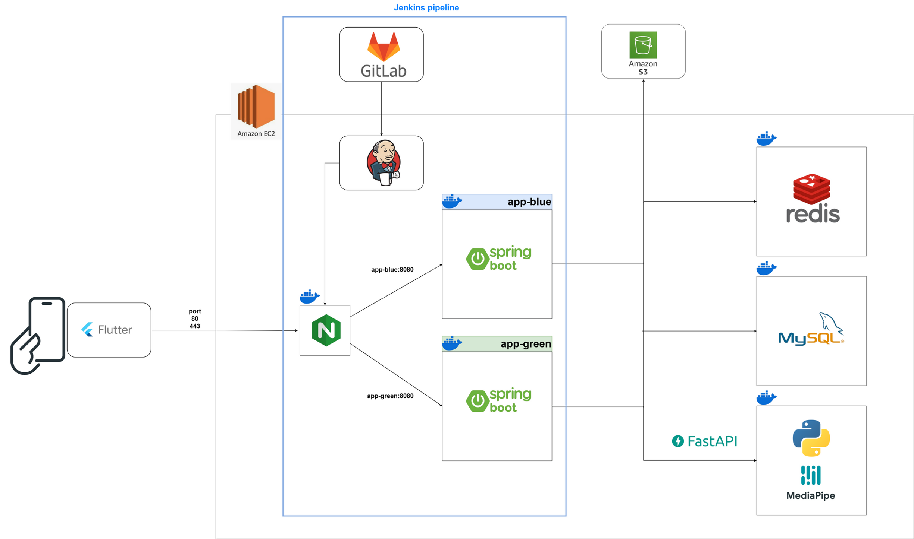

# Prana🧘‍♀️

> **AI 기반 자세 분석으로 실시간 피드백을 제공하는 맞춤형 홈 요가 학습 도우미**  
⏱ 2025.02.24 ~ 2025.04.11

[1️⃣ 원스토어에서 Prana 다운로드하기](https://m.onestore.co.kr/ko-kr/apps/appsDetail.omp?prodId=0001000346)

 

## 👥 Developers

<table>
  <thead>
    <tr>
      <th>박예승 👑</th>
      <th>이다이</th>
      <th>김재준</th>
      <th>이건우</th>
      <th>임혁</th>
      <th>한슬기</th>
    </tr>
  </thead>
  <tbody>
    <tr>
      <td>
         
        FE
      </td>
      <td>
         
        FE
      </td>
      <td>
         
        AI · FE
      </td>
      <td>
         
        BE · AI
      </td>
      <td>
         
        BE · FE · INFRA
      </td>
      <td>
         
        BE · INFRA
      </td>
    </tr>
  </tbody>
</table>

## 🔑 Key Features

## 🧩 System Architecture

## 🔧 What We Used

##### Frontend
   

##### Backend
   

##### Infra / DevOps
    

##### AI
   

##### Collaboration / Design
    
